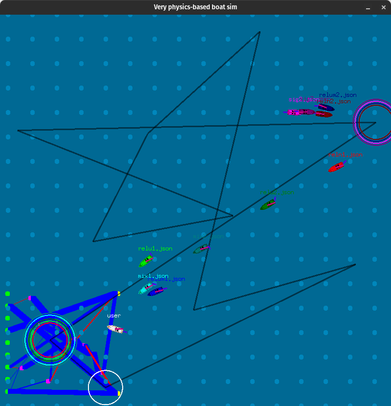

# neat-sail - using the NEAT algorithm to race sailing boats
This is a small project where I tried to simulate sailing boats in the ocean. I then train AIs using NEAT (github.com/JoshPattman/goevo) to try to get round the course as fast as possible. You can then load up the trained models, and try to beat them as a human controlling a boat. This is quite tricky though!

## About

When you run a sim, you have control of the white boat. Use QE to control the sail angle, and AD to control the rudder andle. All boats are aiming to get within the circle that matches their color. The wind is shown as the light blue dots moving across the screen. In the bottom left corner, the first network in the list of network brains is visualised.

## Usage
To use, find the latest release, and download the built binary for your OS. Alternatively, you can download the repo and look in the Makefile to see how to compile it yourself. Also download the models.zip folder and unzip it next to the binary, if you want to use some of the pre-trained models that I have made.

To run a simulation with a set of pre trained models (you can also load your own models that you have trained):

`$ ./neat-sail -filename models/reln1.json:models/reln2.json:models/relu1.json:models/relu2.json:models/relum1.json:models/relum2.json:models/sig2.json:models/sig3.json:models/mix1.json:models/mix2.json`

To train a new model under specified training conditions:

`$ ./neat-sail -train -filename trained-net.json`

When training your own model, there are many options available for parameters to the neat algorithm. Run `$ ./neat-sail -help` to see them all.